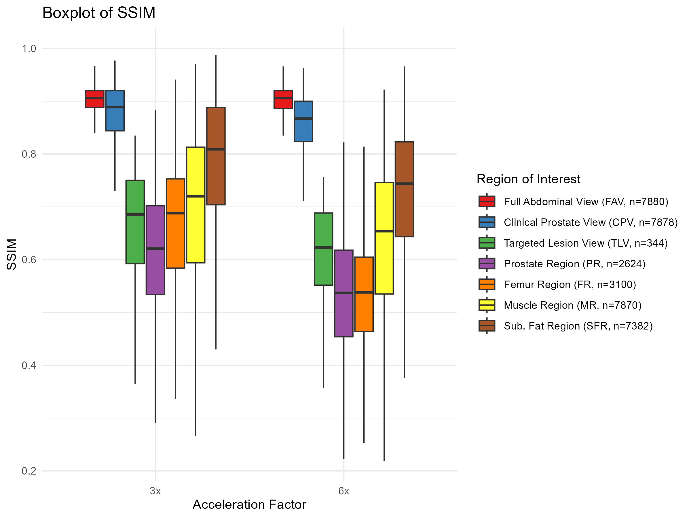

# MRI DLRecon FOV Analysis

## Overview
This repository contains the code and data for analyzing a **Deep Learning Reconstruction (DLR)** model on accelerated k-space MRI data. The analysis focuses on different **Fields of View (FOVs)** and assesses visual quality metrics in various regions of the image.

## Results
### Boxplot
- The violin plot below illustrates the distribution of SSIM, PSNR, RMSE, and HFEN for the 120 patients across acceleration factors R3 and R6.

### Fields of view (FOVs)
1. Full abdominal view (FAV) This is the full view where air around the body is visible. This FOV is obtained directly from k-space. There is no-cropping involved in either k-space or image space.
2. Clinical Prostate View (CPV). This is the view where we see the prostate and organs around it. We see no air around the body. This usually is a 2x zoomed in version of the abdominal FOV.
3. Targeted Lesion Region (TLR). A PIRADS 3+ lesion segmentation, drawn by a radiologists with an extra 10 pixel added on both the x and y direction.

## Project Description
We aim to evaluate the performance of a DLR model by computing visual quality metrics across different acceleration factors (R3 and R6) for 120 test patients. The metrics include **SSIM**, **PSNR**, and **HFEN**. The analysis is performed on each 2d slice separately and lesion-specific 2D slices.

## Visual Quality Metrics
- **SSIM (Structural Similarity Index Measure)**
- **PSNR (Peak Signal-to-Noise Ratio)**
- **HFEN (High-Frequency Error Norm)**

## Acceleration Factors
- **R1**: Ground truth (3 averages with parallel imaging factor of 2) Created with Root Sum of Squares (RSS)
- **R3**: first out of three averages
- **R6**: 1/2 an average with parallel imaging factor of 4

**Example Segmentations with TotalSegmentator**
In addition to the FAV, CPV and TLR, four reference regions were assessed with the IQMs. Total body segmentation was performed using the TotalSegmentator (https://github.com/wasserth/TotalSegmentator).
We will consider 4 reference regions:
- SFR: subcutaneous fat region
- MR: muscle region
- PR: prostate region
- FR: femur left region

## Data
The data used for this project is the UMCG testing cohort with patients suspected of having csPCa. Data was collected between 2022 and 2024. 
Date of data analysis: Juli 2024

