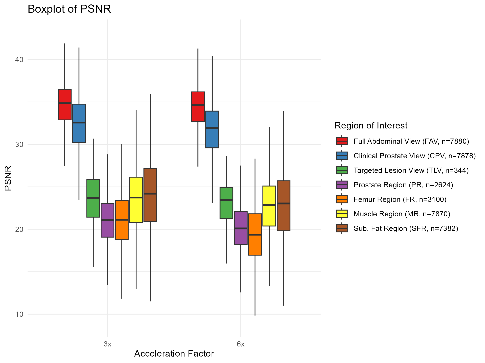

# MRI DLRecon FOV Analysis
Under active development.

## Overview
This repository contains the code and data for analyzing a **Deep Learning Reconstruction (DLR)** model on accelerated k-space MRI data. The study focuses on evaluating the visual quality metrics across different **Fields of View (FOVs)** and assesses the model's performance in various anatomical regions. This analysis aims to enhance MRI efficiency and image quality, particularly for prostate cancer diagnostics.

## Methods
### Dataset
The training dataset comprises 312 patients from the publicly available fastMRI prostate k-space dataset from New York University (NYU). The testing cohort includes 120 patients from the UMCG dataset, collected between 2022 and 2024, suspected of having clinically significant prostate cancer (csPCa).

### Model Training
The DLR model was trained using various undersampling schemes with acceleration factors of 2, 4, 6, and 8. Different fractions of the fully sampled central k-space region were retained, and retrospective undersampling patterns were applied.

### Evaluation Metrics
Visual quality metrics such as **SSIM**, **PSNR**, and **HFEN** were computed for different acceleration factors (R3 and R6). These metrics were analyzed on each 2D slice and lesion-specific 2D slices to assess the model’s performance comprehensively.

## Results
### Violin Plot
- The violin plots below illustrate the distribution of SSIM, PSNR, and HFEN for the 120 patients across acceleration factors R3 and R6.

### Fields of View (FOVs)
1. **Full Abdominal View (FAV)**: This full view includes the air around the body and is obtained directly from k-space without any cropping.
2. **Clinical Prostate View (CPV)**: This view focuses on the prostate and surrounding organs, excluding air around the body. It is typically a 2x zoomed version of the abdominal FOV.
3. **Targeted Lesion Region (TLR)**: A PIRADS 3+ lesion segmentation drawn by radiologists, with an additional 10 pixels added to both the x and y dimensions.

### Key Findings
- Significant reduction in reconstruction time for accelerated datasets.
- SSIM values differed significantly between global (CPV) and local (PR) regions, indicating the importance of targeted quality assessments.
- Interaction terms showed more pronounced SSIM degradation in diagnostically relevant regions, such as the TLR and PR, at higher acceleration factors (p < 0.001).

## Visual Quality Metrics
- **SSIM (Structural Similarity Index Measure)**: Assesses the similarity between two images.
- **PSNR (Peak Signal-to-Noise Ratio)**: Measures the ratio between the maximum possible power of a signal and the power of corrupting noise.
- **HFEN (High-Frequency Error Norm)**: Evaluates the preservation of high-frequency details in the image.

## Acceleration Factors
- **R1**: Ground truth (3 averages with a parallel imaging factor of 2) created using Root Sum of Squares (RSS).
- **R3**: First out of three averages.
- **R6**: Half an average with a parallel imaging factor of 4.

## Example Segmentations with TotalSegmentator
In addition to the FAV, CPV, and TLR, four reference regions were assessed using IQMs. Total body segmentation was performed using the TotalSegmentator (https://github.com/wasserth/TotalSegmentator). The reference regions considered are:
- **SFR**: Subcutaneous fat region.
- **MR**: Muscle region.
- **PR**: Prostate region.
- **FR**: Femur left region.

## Data
The data used for this project is the UMCG testing cohort, comprising patients suspected of having clinically significant prostate cancer (csPCa). Data was collected between 2022 and 2024. 
Date of data analysis: July 2024
