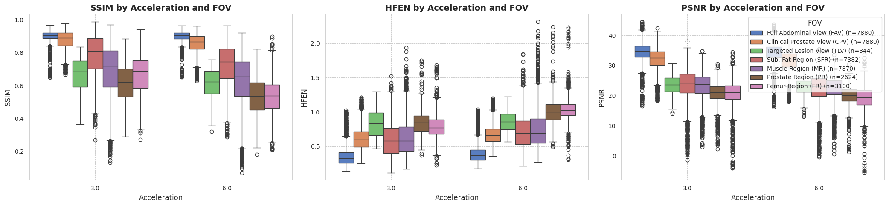

# MRI DLRecon FOV Analysis

## Overview
This repository contains the code and data for analyzing a **Deep Learning Reconstruction (DLR)** model on accelerated k-space MRI data. The analysis focuses on different **Fields of View (FOVs)** and assesses visual quality metrics in various regions of the image.

### Fields of view (FOVs)
1. Full abdominal FOV. This is the full FOV where air around the body is visible. This FOV is obtained directly from k-space. There is no-cropping involved in either k-space or image space.
2. Prostate FOV. This is the FOV where we see the prostate and organs around it. We see no air around the body. This usually is a 2x zoomed in version of the abdominal FOV.
3. Lesion FOV. A PIRADS 3+ lesion segmentation, drawn by a radiologists with an extra 10 pixel added on both the x and y direction.

Note: FOV 1 and 2 are considered for each slice, while lesion FOV is considered only for slices with lesions in them.

**Example Segmentations with TotalSegmentator**
In addition to the three primary FOVs, abdominal, prostate region and lesion, four reference regions will also have their IQMs computed. Total body segmentation was performed using the TotalSegmentator (https://github.com/wasserth/TotalSegmentator).
We will consider 4 reference regions:
- subcutaneous fat
- skeletal muscle
- prostate
- femur left/right

## Project Description
We aim to evaluate the performance of a DLR model by computing visual quality metrics across different acceleration factors (R3 and R6) for 120 UCMG patients. The metrics include **SSIM**, **PSNR**, **RMSE**, and **HFEN**. The analysis is performed on each 2d slice separately and lesion-specific 2D slices.

## Visual Quality Metrics
- **SSIM (Structural Similarity Index Measure)**
- **PSNR (Peak Signal-to-Noise Ratio)**
- **RMSE (Root Mean Squared Error)**
- **HFEN (High-Frequency Error Norm)**

## Acceleration Factors
- **R1**: Ground truth (3 averages with GRAPPA 2) Created with Root Sum of Squares (RSS)
- **R3**: 1 average out of 3
- **R6**: Half an average with GRAPPA 4

**Placeholder for further explanation and results on 3D vs. 2D analysis.**

## Results
### Boxplot
- The violin plot below illustrates the distribution of SSIM, PSNR, RMSE, and HFEN for the 120 patients across acceleration factors R3 and R6.
<!--  -->

**Placeholder for detailed results and interpretation.**

## Usage
This repository can be used as scientific reference and is used for publication: **URL**

## Data
The data used for this project is the UMCG testing cohort with patients suspected of having csPCa. Data was collected between 2022 and 2024. 
Date of data analysis: Juli 2024

## License
**Placeholder for license information.**

## Contact
**Placeholder for contact information.**

---

### Notes on 2D vs. 3D Analysis

It may make more sense to assess the visual quality in 2D rather than 3D for the following reasons:
- **Detailed Assessment**: 2D analysis allows for a more detailed assessment of each slice, which is crucial for identifying and evaluating lesions.
- **Variability**: 3D analysis averages the metrics across the entire volume, potentially masking significant variations that could be critical for diagnosis and treatment.
- **Computational Efficiency**: While 2D analysis may require more computational resources per slice, it provides a clearer picture of the image quality variations across different slices, especially in clinically significant regions.
